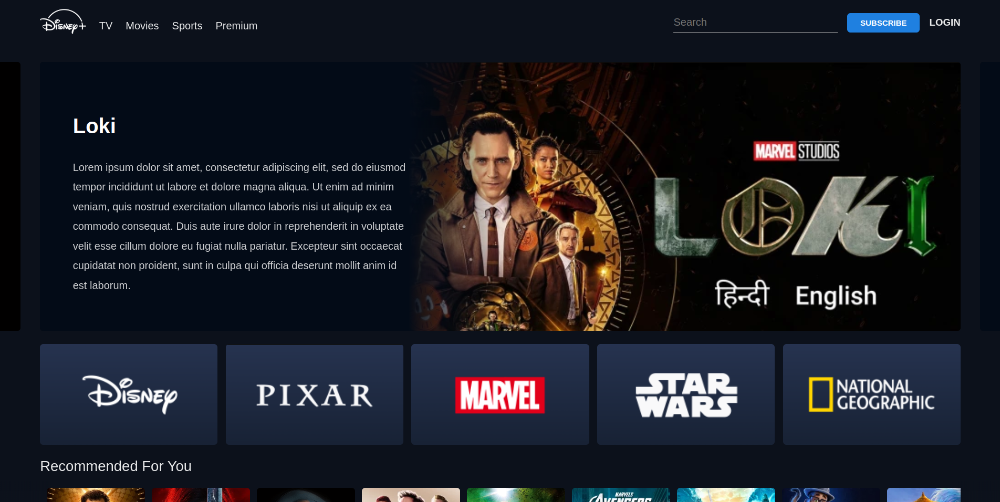
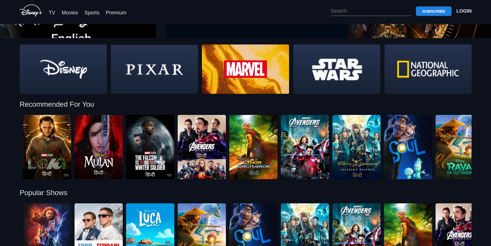
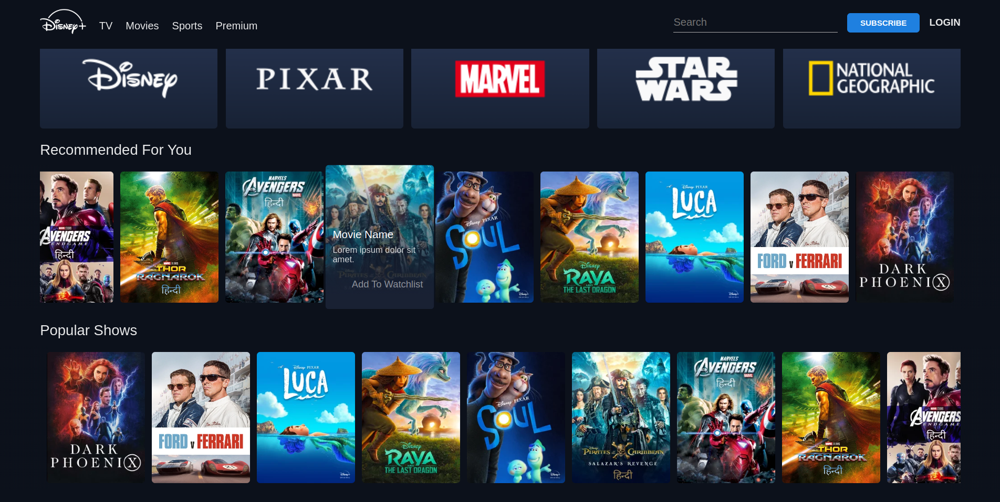

# Hotstar Clone

A simple Hotstar clone built using HTML, CSS, and JavaScript to mimic the UI and basic functionalities of the popular streaming platform.

## Features
- Responsive UI similar to Hotstar
- Smooth navigation and hover effects
- Carousel for featured content
- Video thumbnails with play preview effect

## Technologies Used
- HTML
- CSS
- JavaScript

## Installation
1. Clone the repository:
   ```sh
   git clone https://github.com/yourusername/hotstar-clone.git
   ```
2. Navigate to the project folder:
   ```sh
   cd hotstar-clone
   ```
3. Open `index.html` in a web browser.

## Screenshots
<p align="center">
  
</p>

<p align="center">
    
  
</p>
